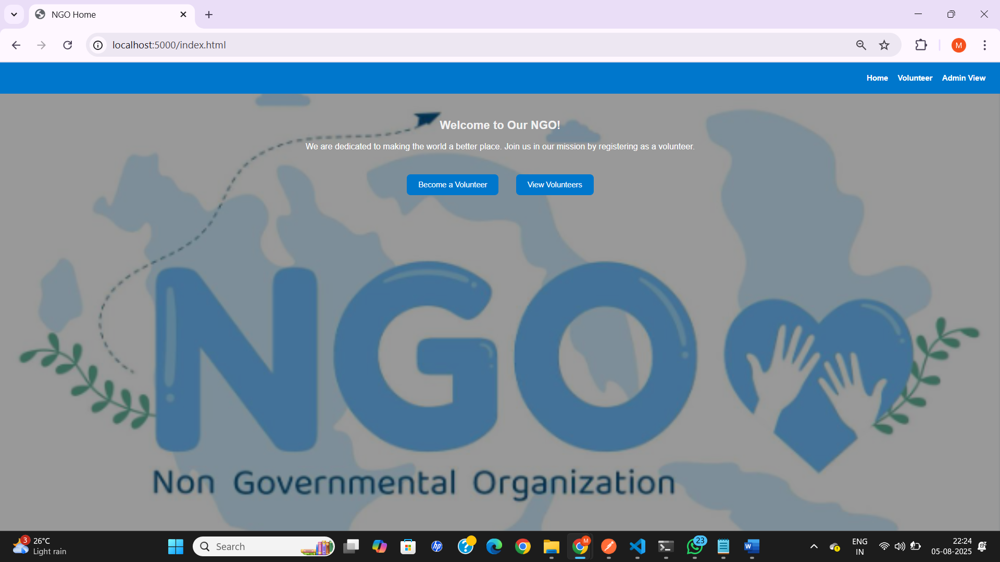
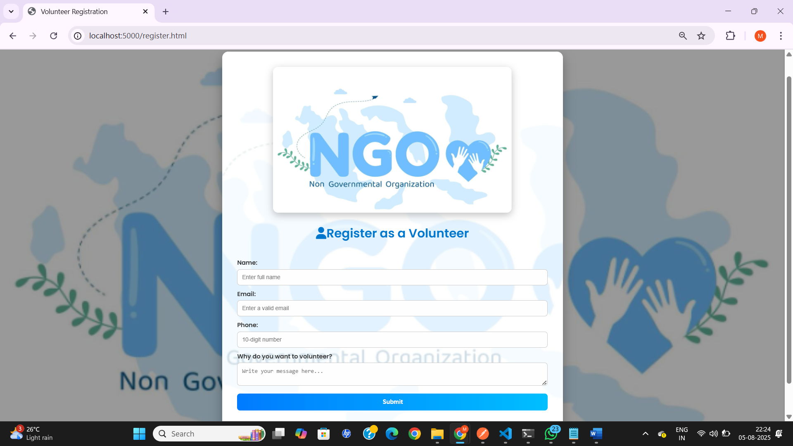
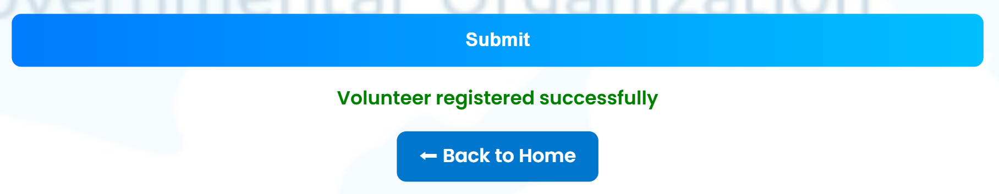
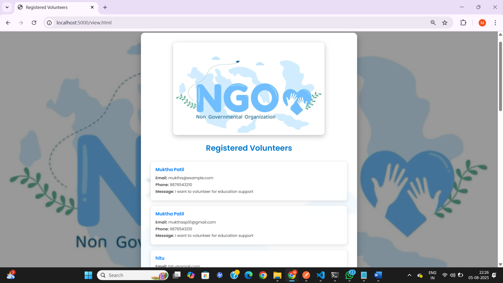
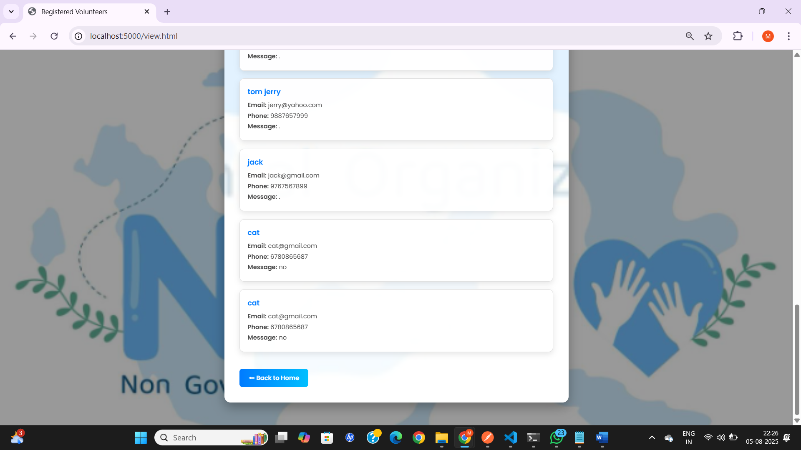

# NGO Volunteer Management Web App

A simple full-stack web application for NGOs to manage volunteer registrations and view applicants.

---

## 🌐 Live URLs

- **Frontend:** [https://dulcet-chebakia-dad0b2.netlify.app](https://dulcet-chebakia-dad0b2.netlify.app)  
- **Backend:** [https://ngo-backend-fsxy.onrender.com](https://ngo-backend-fsxy.onrender.com)

---

## 🛠 Tech Stack

- **Frontend:** HTML, CSS, JavaScript  
- **Backend:** Node.js, Express.js  
- **Database:** MongoDB Atlas  
- **Deployment:** Render (Backend) + Netlify (Frontend)  

## 📁 Folder Structure
```
NGO_Volunteer_Management/
├── ngo-backend/
│ ├── server.js
│ ├── package.json
│ ├── controllers/
│ ├── models/
│ ├── routes/
│ └── .env (local only)
├── public/ (# Frontend)
│ ├── index.html
│ ├── register.html
│ ├── view.html (password: admin123)
│ ├── style.css
│ ├── register.js
│ └── view.js
├── Screenshots/
│ ├── Home.PNG
│ ├── Volunteer_registration.PNG
│ ├── volunteer_registration_back_to_home.PNG
│ ├── admin_view.PNG
│ └── admin_view_back_to_home.PNG
```

## 🧩 Setup Instructions
### 🔧 Backend Setup
Navigate to the backend folder:

- cd ngo-backend
- npm install
- Create a .env file with your MongoDB URI:
- MONGO_URI=your_mongodb_connection_string
- Start the backend server:
- node server.js
- Your backend will run at: http://localhost:5000

### 💻 Frontend Setup
- Update API URLs inside register.js and view.js:
- fetch('https://ngo-backend-fsxy.onrender.com/api/volunteers')
- Open index.html directly in the browser OR deploy the frontend using Netlify.

## 🚀 Deployment
### Render (Backend)
1. Push ngo-backend/ to GitHub
2. Visit https://render.com
3. Click New → Web Service
4. Connect your GitHub repo
5. Configure:
    - Build Command: npm install
    - Start Command: node server.js
    - Environment Variable: MONGO_URI=...
6. Deploy and get a live backend URL

### Netlify (Frontend)
1. Push public/ folder to GitHub or
2. Visit https://app.netlify.com/drop
3. Drag and drop the folder containing:
index.html, register.html, view.html, and assets
4. Netlify will generate a live frontend URL

## ✅ Features
- Volunteer registration form

- Admin view of volunteer list

- REST API integration with MongoDB Atlas

- Basic client and server-side validation

## 🔮 Future Enhancements
- Admin login panel

- Email confirmations

- Dashboard with analytics

- Pagination, filtering, and search functionality

## 📸 Screenshots

### • Home Page  
[](Screenshots/Home.png)

### • Registration Form  
[](Screenshots/Volunteer_registration.png)  
[](Screenshots/volunteer_registration_back_to_home.png)

### • Admin Panel (Volunteers List)  
[](Screenshots/admin_view.png)  
[](Screenshots/admin_view_back_to_home.png)
